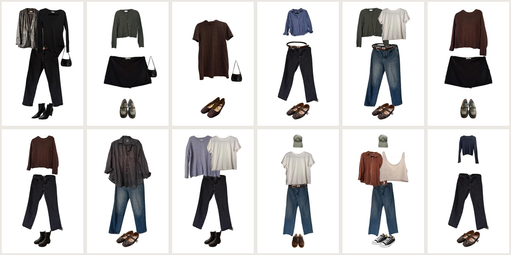
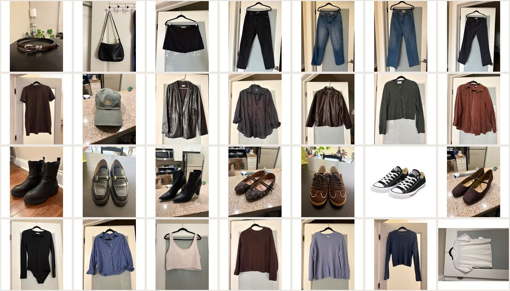

# Closet

A personal wardrobe manager. Photograph your clothes, and it cuts each garment out of its
background, lays outfits out on a figure, tracks what you actually wear, and tells you what
to wear next.

Built solo with [Claude Code](https://claude.com/claude-code). In daily use on a real
wardrobe: **195 garments, 80 outfits, 55 logged wears.**



*Real outfits from the sample photos below — background removal, layering order, and
per-category positioning are all automatic.*

---

## Run it with Claude Code

Most people will want an agent to do the setup. Clone the repo, open it, and paste this:

```
Set this project up and run it locally.

1. Read README.md and SETUP.md first.
2. Install dependencies with npm install.
3. I need a Supabase project (free tier) and a Replicate API token. Walk me through
   getting both, one step at a time, and tell me exactly which values to paste where.
4. Create .env.local from what I give you, then run the Prisma migrations.
5. Start the dev server and tell me what URL to open.
6. Then import the sample wardrobe:
   npx tsx scripts/import-photos.ts --manifest sample-photos/manifest.json --apply
7. Wait for image processing to finish, then tell me which pages to look at and what
   I should expect to see on each.

Stop and ask me whenever you need a credential or a decision. Don't guess at values.
```

**What it needs from you:** a free [Supabase](https://supabase.com) project (Postgres +
Storage) and a [Replicate](https://replicate.com) API token for the image models.
Replicate is pay-per-use and processing the 28 sample photos costs well under a dollar.

Everything else the agent can do unattended.

## Or set it up yourself

Requires Node 20.9+.

```bash
npm install
# Create .env.local — template and instructions in SETUP.md §4
npx prisma migrate dev
npm run dev
```

Open [localhost:3000](http://localhost:3000), then load the sample wardrobe:

```bash
npx tsx scripts/import-photos.ts --manifest sample-photos/manifest.json --apply
```

```bash
npm test               # 256 tests, 19 files
npm run test:watch
```

---

## The sample wardrobe

`sample-photos/` holds 28 real garment photos and a `manifest.json` describing them, so
you can run the whole thing on a working wardrobe instead of an empty one.



These are **originals, not finished cut-outs** — photographed on hangers against a door,
in ordinary light, which is the input the app is built for. Importing them exercises the
real pipeline: background removal, hanger removal, render measurement. Shipping the
processed PNGs would have skipped the half of the app that's actually interesting.

The set was chosen by script (`scripts/pick-samples.ts`) rather than by eye, picking
outfits first and taking their garments, so every photo belongs to at least one complete
outfit. It builds **12 outfits** including five layered looks, two with a hat, a dress, two
skirts and four kinds of footwear.

---

## What it does

**Catalog** (`/catalog`) — Upload a photo and the garment is cut out of its background,
the hanger removed, and the result normalised onto a 1024px canvas with a per-category
vertical anchor. Name, category, colours, seasons, brand, size, price and free-form
attributes are all editable; colours are normalised to a shared vocabulary so filters
work. Prices can be estimated automatically from the garment description.

**Outfits** (`/outfits`) — Build a look from catalogued pieces and it's composed onto a
figure: each garment positioned by anatomical landmark, shoulders matched between layers,
gaps closed, then the whole thing fitted to frame. Any slot holds as many pieces as you
like, so a t-shirt under a sweater under a coat layers correctly — **outermost to the
left, innermost to the right**, the way a flat lay is arranged. Tops layer over dresses.
Editing an outfit creates a new version and regenerates its name; identical outfits are
recognised as the same outfit rather than duplicated.

**Calendar** (`/calendar`) — Log what you wore, including future dates to plan ahead. Two
outfits in one day show as two. If you added something on the day — a jacket, different
shoes — the calendar shows what you *actually* wore, not the saved version. You can record
compliments on a wear, and add what you wore it with from a list ranked by what you
usually throw on.

**Home** (`/`) — Sunday-to-Saturday week view, this week's compliment count, and **Wear
soon**: recommendations grouped casual / work / gym, filtered by season, damped so a
cardigan isn't suggested the day after you wore a cardigan. Plus **Least worn**, to surface
what's going unused. Anything you don't want suggested can be shelved with a reason.

**Inspiration** (`/inspiration`) — Save a photo of an outfit you like and a vision model
reads it into pieces. Each piece is matched against your closet and marked owned, similar,
or missing — with a picture of the garment it matched, and the outfit rebuilt from what you
own. What's missing becomes a shopping list.

**Stats** — Cost per wear for every garment, wear windows, and neglected-item detection.

---

## How it works

Next.js 16 (App Router) · TypeScript · Tailwind v4 · Prisma 7 · Supabase (Postgres,
Storage, Auth) · Replicate (`851-labs/background-remover`, `schananas/grounded_sam`,
`gpt-4o-mini` for vision)

```
app/          routes (App Router)
components/   UI, grouped by feature
lib/          business logic — framework-free and unit-testable
  images/     segment.ts (hanger removal), normalize.ts, pipeline.ts
  outfits/    slots.ts (composition), recommend.ts, signature.ts, set-aside.ts
  inspiration/read.ts (vision), match.ts
  stats/      cost-per-wear.ts, neglected.ts, wear-windows.ts
  wears/      calendar.ts, shown.ts, extras.ts, planned.ts
prisma/       schema.prisma, migrations
scripts/      import, reprocess, measure, and the sample-set tooling
tests/        mirrors lib/
```

`lib/` holds no framework imports on purpose. Outfit identity, cost-per-wear, the
recommendation rules, hanger detection and layout geometry are the logic most likely to be
subtly wrong, so they're testable without a database or a browser.

Two platform notes worth knowing: **Prisma 7** keeps connection URLs in
`prisma.config.ts` and connects through a driver adapter, and migrations use `DIRECT_URL`
while the app uses the pooled `DATABASE_URL`. **Tailwind v4** is CSS-first — design tokens
live in `app/globals.css` under `@theme` and there is no `tailwind.config.ts`.

---

## What broke and why

The interesting part of this project wasn't getting features working. It was the bugs where
the code did exactly what I asked and the answer was still wrong.

**A season rule that was right about the garment and wrong about the outfit.** Short-sleeve
tops were tagged for autumn, which is true — you wear them in autumn, under things. But the
recommender then suggested a short-sleeve top *alone* in November. The fix wasn't to narrow
the garment's seasons; it was to judge warmth at the **outfit** level, with a floor the
whole look has to clear. A correct fact about a part became a wrong conclusion about the
whole.

**A variety penalty that never fired.** Recommendations were damped so you don't get a
cardigan the day after wearing a cardigan. It kept happening. The penalty subtracted a
fixed 55 points — and never-worn garments scored 120, so the damping could never overcome
the novelty bonus. Changing it to a multiplicative factor fixed it immediately. A penalty
expressed in the wrong units is indistinguishable from no penalty.

**Hanger removal that erased camisole straps.** The first approach erased anything that
wasn't clothing. Thin straps don't look like clothing to a segmentation mask, so they went.
Rewritten to prompt *positively* for the hanger, plus an island pass that spares pieces
taller than they are wide which reach the garment. Along the way one test could never pass:
it required the hanger bar to enclose a hole, and scoop necklines are open at the top, so
the mask reported **zero** enclosed holes on exactly the garments the test was for.

**Bottoms rendered 13–18% too small.** Layout assumed each category's maximum extent on
the canvas. Tops are height-constrained there, but bottoms are *width*-constrained, so
trousers came out short and sat below the top's hem instead of meeting it. Fixed by
measuring each render and storing the real dimensions. The assumption was invisible because
it was almost right.

**Every outfit rendered blank.** Layers set a percentage height, and a percentage resolves
against the containing block's height — which a CSS `aspect-ratio` box doesn't reliably
provide. So all layers collapsed to zero. Giving the wrapper a definite height with padding
and passing it down with `inset-0` fixed it. Nothing was wrong with the layout maths at
all.

**"Wore it with" silently recorded nothing.** The form submitted fine and returned 200. Its
hidden inputs were rendered *after* `</form>`, so they were never part of the submission.
A success response is not evidence that anything was saved.

**A vision match that was confidently wrong.** A raspberry midi dress was read as "red maxi
dress" and matched against a dark red maxi I owned — reported as OWNED, so it never made
the shopping list. The cause was double-counting: the colour and category words were
scored again as name overlap, so agreeing on "red" and "dress" looked like strong evidence.
Now OWNED requires a third distinguishing signal beyond colour and category.

**A test harness that reported success for the wrong reason.** `check-pages.sh` piped page
output into `grep -q`, which exits at the first match — so `printf` died of `SIGPIPE`, and
under `pipefail` the pipeline returned 141 while the page was fine. Counting matches with
`grep -c` instead fixed it. The harness checking for failures was itself failing silently.

---

## Credits

Garment photos in `sample-photos/` are my own, released with the repo so the app can be run
on a real wardrobe. Image models are hosted on Replicate and credited above.
